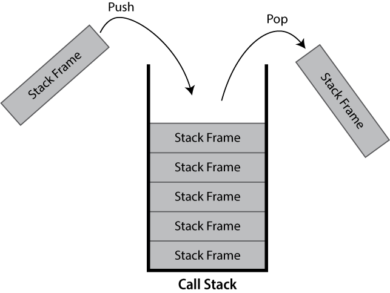

:::::::::::::::::::::::::::::::::::::: questions

- When is function level profiling appropriate?
- How can `cProfile` and `snakeviz` be used to profile a Python program?
- How are the outputs from function level profiling interpreted?

::::::::::::::::::::::::::::::::::::::::::::::::

::::::::::::::::::::::::::::::::::::: objectives

- execute a Python program via `cProfile` to collect profiling information about a Python program’s execution
- use `snakeviz` to visualise profiling information output by `cProfile`
- interpret `snakeviz` views, to identify the functions where time is being spent during a program’s execution

::::::::::::::::::::::::::::::::::::::::::::::::

## Introduction
<!-- TODO Currently it's a verbatim copy from profiling-introduction.md, there's space for more context in this episode.>

<!-- Context -->
Software is typically comprised of a hierarchy of function calls, both functions written by the developer and those used from the language's standard library and third party packages.

<!-- What -->
Function-level profiling analyses where time is being spent with respect to functions. Typically function-level profiling will calculate the number of times each function is called and the total time spent executing each function, inclusive and exclusive of child function calls.

<!-- Why -->
This allows functions that occupy a disproportionate amount of the total runtime to be quickly identified and investigated.

<!-- We will be covering -->
In this episode we will cover the usage of the function-level profiler `cProfile`, how it's output can be visualised with `snakeviz` and how the output can be interpreted.


::::::::::::::::::::::::::::::::::::: callout

## What is a Call Stack?

The call stack keeps track of the active hierarchy of function calls and their associated variables.

As a stack it is a last-in first-out (LIFO) data structure.

{alt="A greyscale diagram showing a (call)stack, containing 5 stack frame. Two additional stack frames are shown outside the stack, one is marked as entering the call stack with an arrow labelled push and the other is marked as exiting the call stack labelled pop."}

When a function is called, a frame to track its variables and metadata is pushed to the call stack.
When that same function finishes and returns, it is popped from the stack and variables local to the function are dropped.

If you've ever seen a stack overflow error, this refers to the call stack becoming too large.
These are typically caused by recursive algorithms, whereby a function calls itself, that don't exit early enough.

Within Python the current call-stack can be printed using the core `traceback` package, `traceback.print_stack()` will print the current call stack.


The below example:

```python
import traceback

def a():
    b1()
    b2()
def b1():
    pass
def b2():
    c()
def c():
    traceback.print_stack()

a()
```

Here we can see that the printing of the stack trace is called in `c()`, which is called by `b2()`, which is called by `a()`, which is called from global scope.

Hence, this prints the following call stack:

```output
  File "C:\call_stack.py", line 13, in <module>
    a()
  File "C:\call_stack.py", line 5, in a
    b2()
  File "C:\call_stack.py", line 9, in b2
    c()
  File "C:\call_stack.py", line 11, in c
    traceback.print_stack()
```

The first line states the file and line number where `a()` was called from (the last line of code in the file shown). The second line states that it was the function `a()` that was called, this could include its arguments. The third line then repeats this pattern, stating the line number where `b2()` was called inside `a()`. This continues until the call to `traceback.print_stack()` is reached.

You may see stack traces like this when an unhandled exception is thrown by your code.

*In this instance the base of the stack has been printed first, other visualisations of call stacks may use the reverse ordering.*

:::::::::::::::::::::::::::::::::::::::::::::

## cProfile

<!-- What is cProfile/How is it installed -->
[`cProfile`](https://docs.python.org/3/library/profile.html#instant-user-s-manual) is a function-level profiler provided as part of the Python standard library.

<!-- How is it used? -->
It can be called directly within your Python code as an imported package, however it's easier to use its script interface:

```sh
python -m cProfile -o <output file> <script name> <arguments>
```

For example if you normally run your program as:

```sh
python my_script.py input.csv
```

You would call `cProfile` to produce profiling output `out.prof` with:

```sh
python -m cProfile -o out.prof my_script.py input.csv
```

<!-- yes it's that simple -->
*No additional changes to your code are required, it's really that simple!*

<!-- TODO should the remainder of this section be in a call-out, it's unnecessary -->
If you instead, don't specify output to file (e.g. remove `-o out.prof` from the command), `cProfile` will produce output to console similar to that shown below:

```output
         28 function calls in 4.754 seconds

   Ordered by: standard name

   ncalls  tottime  percall  cumtime  percall filename:lineno(function)
        1    0.000    0.000    4.754    4.754 worked_example.py:1(<module>)
        1    0.000    0.000    1.001    1.001 worked_example.py:13(b_2)
        3    0.000    0.000    1.513    0.504 worked_example.py:16(c_1)
        3    0.000    0.000    1.238    0.413 worked_example.py:19(c_2)
        3    0.000    0.000    0.334    0.111 worked_example.py:23(d_1)
        1    0.000    0.000    4.754    4.754 worked_example.py:3(a_1)
        3    0.000    0.000    2.751    0.917 worked_example.py:9(b_1)
        1    0.000    0.000    4.754    4.754 {built-in method builtins.exec}
       11    4.753    0.432    4.753    0.432 {built-in method time.sleep}
        1    0.000    0.000    0.000    0.000 {method 'disable' of '_lsprof.Profiler' objects}
```

The columns have the following definitions:

| Column | Definition |
|---------|---------------------------------------------------|
| `ncalls`  | The number of times the given function was called. |
| `tottime` | The total time spent in the given function, excluding child function calls. |
| `percall` | The average tottime per function call (`tottime`/`ncalls`). |
| `cumtime` | The total time spent in the given function, including child function calls. |
| `percall` | The average cumtime per function call (`cumtime`/`ncalls`). |
| `filename:lineno(function)` | The location of the given function's definition and it's name. |

This output can often exceed the terminal's buffer length for large programs and can be unwieldy to parse, so the package `snakeviz` is often utilised to provide an interactive visualisation of the data when exported to file.


## snakeviz

:::::::::::::::::::::::::::::::::: instructor

It can help to run these examples by running `snakeviz` live.
For the worked example you may wish to also show the code (e.g. in split screen).

Demonstrate features such as moving up/down the call-stack by clicking the boxes and changing the depth and cutoff via the dropdown.

Download pre-generated profile reports:

* snakeviz example screenshot: <a href="files/schelling_out.prof" download>files/schelling_out.prof</a>

* Worked example: <a href="files/snakeviz-worked-example/out.prof" download>files/snakeviz-worked-example/out.prof</a>

:::::::::::::::::::::::::::::::::::::::::::::

<!-- what is snakeviz/how is it installed-->
[`snakeviz`](https://jiffyclub.github.io/snakeviz/) is a web browser based graphical viewer for `cProfile` output files.
<!--TODO is covering pip here redundant as it's covered in the user setup file? -->
It is not part of the Python standard library, and therefore must be installed via pip.

```sh
pip install snakeviz
```

Once installed, you can visualise a `cProfile` output file such as `out.prof` via:

```sh
python -m snakeviz out.prof
```

This should open your web browser displaying a page similar to that below.

{alt='A web page, with a central diagram representing a call-stack, with the root at the top and the horizontal axis representing the duration of each call. Below this diagram is the top of a table detailing the statistics of individual methods.'}

<!-- From SnakeViz docs
In the icicle visualization style functions are represented by rectangles. A root function is the top-most rectangle, with functions it calls below it, then the functions those call below them, and so on. The amount of time spent inside a function is represented by the width of the rectangle. A rectangle that stretches across most of the visualization represents a function that is taking up most of the time of its calling function, while a skinny rectangle represents a function that is using hardly any time at all.
-->

The icicle diagram displayed by `snakeviz` represents an aggregate of the call stack during the execution of the profiled code.
The box which fills the top row represents the root call, filling the row shows that it occupied 100% of the runtime.
The second row holds the child methods called from the root, with their widths relative to the proportion of runtime they occupied.
This continues with each subsequent row, however where a method only occupies 50% of the runtime, its children can only occupy a maximum of that runtime hence the appearance of "icicles" as each row gets narrower when the overhead of methods with no further children is accounted for.

By clicking a box within the diagram, it will "zoom" making the selected box the root allowing more detail to be explored. The diagram is limited to 10 rows by default ("Depth") and methods with a relatively small proportion of the runtime are hidden ("Cutoff").

As you hover each box, information to the left of the diagram updates specifying the location of the method and for how long it ran.

::::::::::::::::::::::::::::::::::::: callout

## snakeviz Inside Notebooks

If you're more familiar with writing Python inside Jupyter notebooks you can still use `snakeviz` directly from inside notebooks using the notebooks "magic" prefix (`%`) and it will automatically call `cProfile` for you.

First `snakeviz` must be installed and its extension loaded.

```py
!pip install snakeviz
%load_ext snakeviz
```

Following this, you can either call `%snakeviz` to profile a function defined earlier in the notebook.

```py
%snakeviz my_function()
```

Or, you can create a `%%snakeviz` cell, to profile the python executed within it.

```py
%%snakeviz

def my_function():
    print("Hello World!")

my_function()
```

In both cases, the full `snakeviz` profile visualisation will appear as an output within the notebook!

*You may wish to right click the top of the output, and select "Disable Scrolling for Outputs" to expand its box if it begins too small.*

:::::::::::::::::::::::::::::::::::::::::::::

## Worked Example

:::::::::::::::::::::::::::::::::: instructor

Demonstrate this!

:::::::::::::::::::::::::::::::::::::::::::::

To more clearly demonstrate how an execution hierarchy maps to the icicle diagram, the below toy example Python script has been implemented.

```python
import time

def a_1():
    for i in range(3):
        b_1()
    time.sleep(1)
    b_2()
    
def b_1():
    c_1()
    c_2()

def b_2():
    time.sleep(1)
    
def c_1():
    time.sleep(0.5)

def c_2():
    time.sleep(0.3)
    d_1()

def d_1():
    time.sleep(0.1)

# Entry Point
a_1()
```

All of the methods except for `b_1()` call `time.sleep()`, this is used to provide synthetic bottlenecks to create an interesting profile.

* `a_1()` calls `b_1()` x3 and `b_2()` x1
* `b_1()` calls `c_1()` x1 and `c_2()` x1
* `c_2()` calls `d_1()`

::::::::::::::::::::::::::::::::::::: callout

## Follow Along

Download the <a href="files/snakeviz-worked-example/example.py" download>Python source for the example</a> or <a href="files/snakeviz-worked-example/out.prof" download>`cProfile` output file</a> and follow along with the worked example on your own machine.

```sh
python -m cProfile -o out.prof example.py
python -m snakeviz out.prof
```

:::::::::::::::::::::::::::::::::::::::::::::

<!-- TODO: Alt text here is redundant? -->
{alt='The snakeviz icicle visualisation for the worked example Python code.'}

The third row represents `a_1()`, the only method called from global scope, therefore the first two rows represent Python's internal code for launching our script and can be ignored (by clicking on the third row).

The row following `a_1()` is split into three boxes representing `b_1()`, `time.sleep()` and `b_2()`. Note that `b_1()` is called three times, but only has one box within the icicle diagram. The boxes are ordered left-to-right according to cumulative time, which happens to be the order they were first called.

If the box for `time.sleep()` is hovered it will change colour along with several other boxes that represent the other locations that `time.sleep()` was called from. Note that each of these boxes display the same duration, the timing statistics collected by `cProfile` (and visualised by `snakeviz`) are aggregate, so there is no information about individual method calls for methods which were called multiple times. This does however mean that if you check the properties to the left of the diagram whilst hovering `time.sleep()` you will see a cumulative time of 99% reported, the overhead of the method calls and for loop is insignificant in contrast to the time spent sleeping!

*Below are the properties shown, the time may differ if you generated the profile yourself.*

* **Name:** `<built-in method time.sleep>`
* **Cumulative Time:** `4.71 s (99.99 %)`
* **File:** `~`
* **Line:** `0`
* **Directory:**

As `time.sleep()` is a core Python method it is displayed as "built-in method" and doesn't have a file, line or directory.

If you hover any boxes representing the methods from the above code, you will see file and line properties completed. The directory property remains empty as the profiled code was in the root of the working directory. A profile of a large project with many files across multiple directories will see this filled.

Find the box representing `c_2()` on the icicle diagram, its children are unlabelled because they are not wide enough (but they can still be hovered). Clicking `c_2()` zooms in the diagram, showing the children to be `time.sleep()` and `d_1()`.

To zoom back out you can either click the top row, which will zoom out one layer, or click "Reset Zoom" on the left-hand side.

In this simple example the execution is fairly evenly balanced between all of the user-defined methods, so there is not a clear hot-spot to investigate.

Below the icicle diagram, there is a table similar to the default output from `cProfile`. However, in this case you can sort the columns by clicking their headers and filter the rows shown by entering a filename in the search box. This allows built-in methods to be hidden, which can make it easier to highlight optimisation priorities.

**Notebooks**

If you followed along inside a notebook it might look like this:

{alt="A Jupyter notebook showing the worked example profiled with snakeviz." width=80%}

Because notebooks operate by creating temporary Python files, the filename (shown `1378276351.py` above) and line numbers displayed are not too useful. However, the function names match those defined in the code and follow the temporary file name in parentheses, e.g. `1378276351.py:3(a_1)`, `1378276351.py:9(b_1)` refer to the functions `a_1()` and `b_1()` respectively.

::::::::::::::::::::::::::::::::::::: callout

## Sunburst

`snakeviz` provides an alternate "Sunburst" visualisation, accessed via the "Style" drop-down on the left-hand side.

This provides the same information as "Icicle", however the rows are instead circular with the root method call found at the center.

The sunburst visualisation displays less text on the boxes, so it can be harder to interpret. However, it increases the visibility of boxes further from the root call.

<!-- TODO: Alt text here is redundant? -->
{alt="A sunburst visualisation for the worked example Python code." width=50%}

:::::::::::::::::::::::::::::::::::::::::::::


## Exercises

The following exercises allow you to review your understanding of what has been covered in this episode.

:::::::::::::::::::::::::::::::::: instructor

Arguments 1-9 passed to `travellingsales.py` should execute relatively fast (less than a minute)

This will be slower via the profiler, and is likely to vary on different hardware.

Larger values should be avoided.

Download the set of profiles for arguments 1-10, these can be opened by passing the directory to `snakeviz`.


* <a href="files/travelling-sales/profiles.zip" download>files/travelling-sales/profiles</a>

```sh
python -m snakeviz .
```

:::::::::::::::::::::::::::::::::::::::::::::
::::::::::::::::::::::::::::::::::::: challenge

## Exercise 1: Travelling Salesperson

Download and profile <a href="files/travelling-sales/travellingsales.py" download>this</a> Python program, try to locate the function call(s) where the majority of execution time is being spent.

> The travelling salesperson problem aims to optimise the route for a scenario where a salesperson is requires to travel between N locations.
> They wish to travel to each location exactly once, in any order, whilst minimising the total distance travelled.
>
> The provided implementation uses a naive brute-force approach.

The program can be executed via `python travellingsales.py <cities>`.
The value of `cities` should be a positive integer, this algorithm has poor scaling so larger numbers take significantly longer to run.

:::::::::::::::::::::::: hint

- If a hotspot isn't visible with the argument `1`, try increasing the value.
- If you think you identified the hotspot with your first profile, try investigating how the value of `cities` affects the hotspot within the profile.

:::::::::::::::::::::::::::::::::

:::::::::::::::::::::::: solution

The hotspot only becomes visible when an argument of `5` or greater is passed.

You should see that `distance()` (from `travellingsales.py:11`) becomes the largest box (similarly it's parent in the call-stack `total_distance()`) showing that it scales poorly with the number of cities. With 5 cities, `distance()` has a cumulative time of `~35%` the runtime, this increases to `~60%` with 9 cities.

Other boxes within the diagram correspond to the initialisation of imports, or initialisation of cities. These have constant or linear scaling, so their cost barely increases with the number of cities.

*This highlights the need to profile a realistic test-case expensive enough that initialisation costs are not the most expensive component.*

:::::::::::::::::::::::::::::::::
:::::::::::::::::::::::::::::::::::::::::::::::

:::::::::::::::::::::::::::::::::: instructor

The default configuration of the Predator Prey model takes around 10 seconds to run, it may be slower on other hardware.

Download the pre-generated `cProfile` output, this can be opened with `snakeviz` to save waiting for the profiler.


* <a href="files/pred-prey/predprey_out.prof" download>files/pred-prey/predprey_out.prof</a>

```sh
python -m snakeviz predprey_out.prof
```

:::::::::::::::::::::::::::::::::::::::::::::
::::::::::::::::::::::::::::::::::::: challenge

## Exercise 2: Predator Prey

Download and profile <a href="files/pred-prey/predprey.py" download>the Python predator prey model</a>, try to locate the function call(s) where the majority of execution time is being spent

*This exercise uses the packages `numpy` and `matplotlib`, they can be installed via `pip install numpy matplotlib`.* 

> The predator prey model is a simple agent-based model of population dynamics. Predators and prey co-exist in a common environment and compete over finite resources. 
>
> The three agents; predators, prey and grass exist in a two dimensional grid. Predators eat prey, prey eat grass. The size of each population changes over time. Depending on the parameters of the model, the populations may oscillate, grow or collapse due to the availability of their food source.

The program can be executed via `python predprey.py <steps>`.
The value of `steps` for a full run is 250, however a full run may not be necessary to find the bottlenecks.

When the model finishes it outputs a graph of the three populations `predprey_out.png`.

:::::::::::::::::::::::: solution 

It should be clear from the profile that the method `Grass::eaten()` (from `predprey.py:278`) occupies the majority of the runtime.

From the table below the Icicle diagram, we can see that it was called 1,250,000 times.

{alt='The top 9 rows of the table shown by snakeviz when profiling predprey.py. The top row shows that predprey.py:278(eaten) was called 1,250,000 times, taking a total time of 8 seconds. The table is ordered in descending total time, with the next row taking a mere 0.74 seconds.'}

If the table is ordered by `ncalls`, it can be identified as the joint 4th most called method and 2nd most called method from `predprey.py`.

If you checked `predprey_out.png` (shown below), you should notice that there are significantly more `Grass` agents than `Predators` or `Prey`.

{alt="A line graph plotting population over time through 250 steps of the pred prey model. Grass/20, shown in green, has a brief dip in the first 30 steps, but recovers holding steady at approximately 240 (4800 agents). Prey, shown in blue, starts at 200, quickly drops to around 185, before levelling off for steps and then slowly declining to a final value of 50. The data for predators, shown in red, has significantly more noise. There are 50 predators to begin, this rises briefly before falling to around 10, from here it noisily grows to around 70 by step 250 with several larger declines during the growth."}

Similarly, the `Grass::eaten()` has a `percall` time is inline with other agent functions such as `Prey::flock()` (from `predprey.py:67`).

Maybe we could investigate this further with line profiling!

*You may have noticed many iciles on the right hand of the diagram, these primarily correspond to the `import` of `matplotlib` which is relatively expensive!*

:::::::::::::::::::::::::::::::::
:::::::::::::::::::::::::::::::::::::::::::::::


::::::::::::::::::::::::::::::::::::: keypoints

- A python program can be function level profiled with `cProfile` via `python -m cProfile -o <output file> <script name> <arguments>`.
- The output file from `cProfile` can be visualised with `snakeviz` via `python -m snakeviz <output file>`.
- Function level profiling output displays the nested call hierarchy, listing both the cumulative and total minus sub functions time.

::::::::::::::::::::::::::::::::::::::::::::::::
