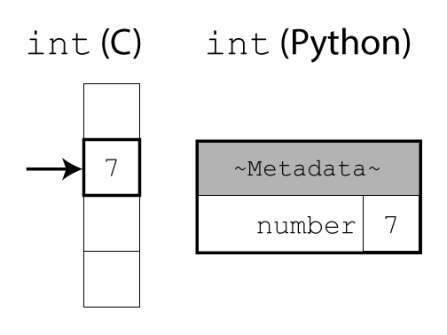

:::::::::::::::::::::::::::::::::::::: questions

- Why could optimisation of code be harmful?

::::::::::::::::::::::::::::::::::::::::::::::::

::::::::::::::::::::::::::::::::::::: objectives

- Able to explain the cost benefit analysis of performing code optimisation

::::::::::::::::::::::::::::::::::::::::::::::::

## Introduction

<!-- Enable you to look at hotspots identified by compiler, identify whether it's efficient -->
Now that you're able to find the most expensive components of your code with profiling, we can think about ways to improve it.
However, the best way to do this will depend a lot on your specific code! For example, if your code is spending 60 seconds waiting to download data files and then 1 second to analyse that data, then optimizing your data analysis code won’t make much of a difference.
We'll talk briefly about some of these external bottlenecks at the end. For now, we’ll assume that you’re not waiting for anything else and we'll look at the performance of your code.

<!-- Necessary to understand how code executes (to a degree) -->
In order to optimise code for performance, it is necessary to have an understanding of what a computer is doing to execute it.

<!-- Goal is to give you a high level understanding of how your code executes. You don't need to be an expert, even a vague general understanding will leave you in a stronger position. -->
Even a high-level understanding of how you code executes, such as how Python and the most common data-structures and algorithms are implemented, can help you to identify suboptimal approaches when programming. If you have learned to write code informally out of necessity, to get something to work, it's not uncommon to have collected some "unpythonic" habits along the way that may harm your code's performance.

<!-- This is largely high-level/abstract knowledge applicable to the vast majority of programming languages, applies even more strongly if using compiled Python features like numba -->
The remaining content is often abstract knowledge, that is transferable to the vast majority of programming languages. This is because the hardware architecture, data-structures and algorithms used are common to many languages and they hold some of the greatest influence over performance bottlenecks.

## Premature Optimisation

> Programmers waste enormous amounts of time thinking about, or worrying about, the speed of noncritical parts of their programs, and these attempts at efficiency actually have a strong negative impact when debugging and maintenance are considered. We should forget about small efficiencies, say about 97% of the time: **premature optimization is the root of all evil**. Yet we should not pass up our opportunities in that critical 3%. - Donald Knuth

This classic quote among computer scientists states; when considering optimisation it is important to focus on the potential impact, both to the performance and maintainability of the code.

Profiling is a valuable tool in this cause. Should effort be expended to optimise a component which occupies 1% of the runtime? Or would that time be better spent focusing on the most expensive components?

Advanced optimisations, mostly outside the scope of this course, can increase the cost of maintenance by obfuscating what code is doing. Even if you are a solo-developer working on private code, your future self should be able to easily comprehend your implementation.

Therefore, the balance between the impact to both performance and maintainability should be considered when optimising code.

This is not to say, don't consider performance when first writing code. The selection of appropriate algorithms and data-structures covered in this course form good practice, simply don't fret over a need to micro-optimise every small component of the code that you write.

### Performance of Python

If you've read about different programming languages, you may have heard that there’s a difference between “interpreted” languages (like Python) and "compiled" languages (like C). You may have heard that Python is slow *because* it is an interpreted language.
To understand where this comes from (and how to get around it), let's talk a little bit about how Python works.

{alt="A diagram illustrating the difference between integers in C and Python. In C, the integer is a raw number in memory. In Python, it additionally contains a header with metadata."}
<!-- Figure inspired by https://jakevdp.github.io/blog/2014/05/09/why-python-is-slow/#1.-Python-is-Dynamically-Typed-rather-than-Statically-Typed. -->

In C, integers (or other basic types) are raw data in memory. It is up to the programmer to keep track of the data type.
The compiler can then turn the source code directly into machine code. This allows the compiler to perform low-level optimisations that better exploit hardware nuance to achieve fast performance. This however comes at the cost of compiled software not being cross-platform.

```C
/* C code */
int a = 1;
int b = 2;
int c = a + b;
```

In Python, everything is a complex object. The interpreter uses extra fields in the header to keep track of data types at runtime or take care of memory management.
This adds a lot more flexibility and makes life easier for programmers. However, it comes at the cost of some overhead in both time and memory usage.

```python
# Python code
a = 1
b = 2
c = a + b
```

::::::::::::::::::::::::::::::::::::: callout

Objects store both their raw data (like an integer or string) and some internal information used by the interpreter.
We can see that additional storage space with `sys.getsizeof()`, which shows how many bytes an object takes up:

```Python
import sys

sys.getsizeof("")  # 41
sys.getsizeof("a")  # 42
sys.getsizeof("ab")  # 43

sys.getsizeof([])  # 56
sys.getsizeof(["a"])  # 64

sys.getsizeof(1)  # 28
```

(Note: For container objects (like lists and dictionaries) or custom classes, values returned by `getsizeof()` are implementation-dependent and may not reflect the actual memory usage.)

:::::::::::::::::::::::::::::::::::::::::::::

We effectively gain programmer performance by sacrificing some code performance. Most of the time, computers are "fast enough" so this is the right trade-off, as Donald Knuth said.

However, there are the few other cases where code performance really matters. To handle these cases, Python has the capability to integrate with code written in lower-level programming language (like C, Fortran or Rust) under the hood.
Some performance-sensitive libraries therefore perform a lot of the work in such low-level code, before returning a nice Python object back to you.
(We’ll discuss NumPy in a later section; but many parts of the Python standard library also use this pattern.)

Therefore, **it is often best to tell the interpreter/library at a high level *what you want*, and let it figure out *how to do it*.**

That way, the interpreter/library is free to do all its work in the low-level code, and adds overhead only once, when it creates and returns a Python object in the end.
This usually makes your code more readable, too: When someone else reads your code, they can see exactly *what you want to do*, without getting overwhelmed by overly detailed step-by-step instructions.


## Ensuring Reproducible Results

<!-- This is also good practice when optimising your code, to ensure mistakes aren't made -->
When optimising your code, you are making speculative changes. It's easy to make mistakes, many of which can be subtle. Therefore, it's important to have a strategy in place to check that the outputs remain correct.

Testing is hopefully already a seamless part of your research software development process.
Test can be used to clarify how your software should perform, ensuring that new features work as intended and protecting against unintended changes to old functionality.

There are a plethora of methods for testing code.

## pytest Overview

Most Python developers use the testing package [pytest](https://docs.pytest.org/en/latest/), it's a great place to get started if you're new to testing code.

Here's a quick example of how a test can be used to check your function's output against an expected value.

Tests should be created within a project's testing directory, by creating files named with the form `test_*.py` or `*_test.py`.

pytest looks for these files, when running the test suite.

Within the created test file, any functions named in the form `test*` are considered tests that will be executed by pytest.

The `assert` keyword is used, to test whether a condition evaluates to `True`.

```python
# file: test_demonstration.py

# A simple function to be tested, this could instead be an imported package
def squared(x):
    return x**2

# A simple test case
def test_example():
    assert squared(5) == 24
```

When `py.test` is called inside a working directory, it will then recursively find and execute all the available tests.

```sh
>py.test
================================================= test session starts =================================================
platform win32 -- Python 3.10.12, pytest-7.3.1, pluggy-1.3.0
rootdir: C:\demo
plugins: anyio-4.0.0, cov-4.1.0, xdoctest-1.1.2
collected 1 item

test_demonstration.py F                                                                                          [100%]

====================================================== FAILURES =======================================================
____________________________________________________ test_example _____________________________________________________

    def test_example():
>       assert squared(5) == 24
E       assert 25 == 24
E        +  where 25 = squared(5)

test_demonstration.py:9: AssertionError
=============================================== short test summary info ===============================================
FAILED test_demonstration.py::test_example - assert 25 == 24
================================================== 1 failed in 0.07s ==================================================
```

Whilst not designed for benchmarking, it does provide the total time the test suite took to execute. In some cases this may help identify whether the optimisations have had a significant impact on performance.

This is only the simplest introduction to using pytest, it has advanced features common to other testing frameworks such as fixtures, mocking and test skipping.
[pytest's documentation](https://docs.pytest.org/en/latest/how-to/index.html) covers all this and more.
You may already have a different testing workflow in-place for validating the correctness of the outputs from your code.

::: instructor

* Fixtures: A test fixture is a common class which multiple tests can inherit from. This class will typically include methods that perform common initialisation and teardown actions around the behaviour to be tested. This reduces repeated code.
* Mocking: If you wish to test a feature which would relies on a live or temperamental service, such as making API calls to a website. You can mock that API, so that when the test runs synthetic responses are produced rather than the real API being used.
* Test skipping: You may have configurations of your software that cause certain tests to be unsupported. Skipping allows conditions to be added to tests, to decide whether they should be executed or skipped.

:::


<!-- todo callout FAIR: testing course (when it's ready) -->

<!--
## Coming Up

In the remainder of this course we will cover:

- Data Structures & Algorithms
  - Lists vs Tuples
  - Sets
  - Generator Functions
  - Searching
- Minimise Python Written
    - built-ins
    - NumPY
    - Pandas
- Newer is Often Faster
  - Keeping Python and packages upto date
- How the Computer Hardware Affects Performance
   - How variables are accessed & the performance implications
   - Latency in perspective
   - Memory allocation isn't free
-->

::::::::::::::::::::::::::::::::::::: keypoints

- The knowledge necessary to perform high-level optimisations of code is largely transferable between programming languages.
- When considering optimisation it is important to focus on the potential impact, both to the performance and maintainability of the code.
- Many high-level optimisations should be considered good-practice.

::::::::::::::::::::::::::::::::::::::::::::::::
