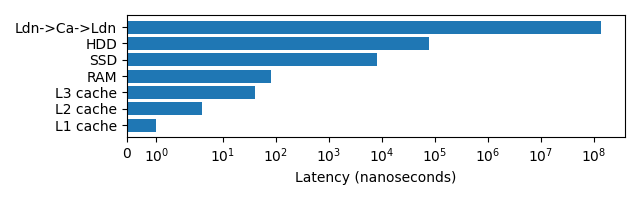

:::::::::::::::::::::::::::::::::::::: questions

- How does a CPU look for a variable it requires?
- What impact do cache lines have on memory accesses?
- Why is it faster to read/write a single 100mb file, than 100 1mb files?

::::::::::::::::::::::::::::::::::::::::::::::::

::::::::::::::::::::::::::::::::::::: objectives

- Able to explain, at a high-level, how memory accesses occur during computation and how this impacts optimisation considerations.
- 

::::::::::::::::::::::::::::::::::::::::::::::::

## Accessing Variables

The storage and movement of data plays a large role in the performance of executing software.


<!-- Read/operate on variable ram->cpu cache->registers->cpu -->
When reading a variable, to perform an operation with it, the CPU will first look in it's registers. These exist per core, they are the location that computation is actually performed. Accessing them is incredibly fast, but there only exists enough storage for around 32 variables (typical number, e.g. 4 bytes).
As the register file is so small, most variables won't be found and the CPU's caches will be searched.
It will first check the current processing core's L1 cache, this small cache (typically 64 KB per physical core) is the smallest and fastest to access cache on a processor.
If the variable is not found in the L1 cache, the L2 cache that is shared between multiple cores will be checked. This shared cache, is slower to access but larger than L1 (typically 1-3MB per core).
This process then repeats for the L3 cache which may be shared among all cores of the processor. This cache again has higher latency to access, but increased size (typically slightly larger than the total L2 cache size).
If the variable has not been found in any of the CPU's cache, the CPU will look to the computer's RAM. This is an order of magnitude slower to access, with several orders of magnitude greater capacity (tens to hundreds of GB are now standard).

Correspondingly, the earlier the CPU finds the variable the faster it will be to access.
However, to fully understand the cache's it's necessary to explain what happens once a variable has been found.

If a variable is not found in the caches, so must be fetched from RAM.
The full 64 byte cache line containing the variable, will be copied first into the CPU's L3, then L2 and then L1.
Most variables are only 4 or 8 bytes, so many neighbouring variables are also pulled into the caches.
Similarly, adding new data to a cache evicts old data.
This means that reading 16 integers contiguously stored in memory, should be faster than 16 scattered integers

Therefore, to **optimally** access variables they should be stored contiguously in memory with related data and worked on whilst they remain in caches.
If you add to a variable, perform large amount of unrelated processing, then add to the variable again it will likely have been evicted from caches and need to be reloaded from slower RAM again.

<!-- Latency/Throughput typically inversely proportional to capacity -->
It's not necessary to remember this full detail of how memory access work within a processor, but the context perhaps helps you understand why memory locality is important.

::::::::::::::::::::::::::::::::::::: callout

Python as a programming language, does not give you enough control to carefully pack your variables in this manner (every variable is an object, so it's stored as a pointer that redirects to the actual data stored elsewhere).

However all is not lost, packages such as `numpy` and `pandas` implemented in C/C++ enable Python users to take advantage of efficient memory accesses (when they are used correctly).

*More on this later*
:::::::::::::::::::::::::::::::::::::::::::::

<!-- TODO python code example 
```python

```-->

## Accessing Disk

<!-- Read data from a file it goes disk->disk cache->ram->cpu cache/s->cpu -->
When accessing data on disk (or network), a very similar process is performed to that between CPU and RAM when accessing variables.

When reading data from a file, it transferred from the disk, to the disk cache, to the RAM.
The latency to access files on disk is another order of magnitude higher than accessing RAM.

As such, disk accesses similarly benefit from sequential accesses and reading larger blocks together rather than single variables.
Python's `io` package is already buffered, so automatically handles this for you in the background.

However before a file can be read, the file system on the disk must be polled to transform the file path to it's address on disk to initiate the transfer (or throw an exception).

Following the common theme of this episode, the cost of accessing randomly scattered files can be significantly slower than accessing a single larger file of the same size.
This is because for each file accessed the file system must be polled to transform the file path to an address on disk. 
Traditional hard disk drives particularly suffer, as the read head must physically move to locate data.

Hence, it can be wise to avoid storing outputs in many individual files and to instead create a macro output file.

This is even visible outside of your own code. If you try to upload/download 1 GB to HPC.
The transfer will be significantly faster if that's a single file, rather than thousands.

The below example code runs a small benchmark, whereby 10MB is written to disk and read back whilst being timed. In one case this is as a single file, and the other, 1000 file segments.

```python
import os, time

# Generate 10MB
data_len = 10000000
data = os.urandom(data_len)
file_ct = 1000
file_len = int(data_len/file_ct)
# Write one large file
start = time.perf_counter()
large_file = open("large.bin", "wb")
large_file.write(data)
large_file.close ()
large_write_s = time.perf_counter() - start
# Write multiple small files
start = time.perf_counter()
for i in range(file_ct):
    small_file = open(f"small_{i}.bin", "wb")
    small_file.write(data[file_len*i:file_len*(i+1)])
    small_file.close()
small_write_s = time.perf_counter() - start
# Read back the large file
start = time.perf_counter()
large_file = open("large.bin", "rb")
t = large_file.read(data_len)
large_file.close ()
large_read_s = time.perf_counter() - start
# Read back the small files
start = time.perf_counter()
for i in range(file_ct):
    small_file = open(f"small_{i}.bin", "rb")
    t = small_file.read(file_len)
    small_file.close()
small_read_s = time.perf_counter() - start
# Print Summary
print(f"{1:5d}x{data_len/1000000}MB Write: {large_write_s:.5f} seconds")
print(f"{file_ct:5d}x{file_len/1000}KB Write: {small_write_s:.5f} seconds")
print(f"{1:5d}x{data_len/1000000}MB Read: {large_read_s:.5f} seconds")
print(f"{file_ct:5d}x{file_len/1000}KB Read: {small_read_s:.5f} seconds")
print(f"{file_ct:5d}x{file_len/1000}KB Write was {small_write_s/large_write_s:.1f} slower than 1x{data_len/1000000}MB Write")
print(f"{file_ct:5d}x{file_len/1000}KB Read was {small_read_s/large_read_s:.1f} slower than 1x{data_len/1000000}MB Read")
# Cleanup
os.remove("large.bin")
for i in range(file_ct):
    os.remove(f"small_{i}.bin")
```

Running this locally, on an SSD I received the following timings.

```sh
    1x10.0MB Write: 0.00198 seconds
 1000x10.0KB Write: 0.14886 seconds
    1x10.0MB Read: 0.00478 seconds
 1000x10.0KB Read: 2.50339 seconds
 1000x10.0KB Write was 75.1 slower than 1x10.0MB Write
 1000x10.0KB Read was 523.9 slower than 1x10.0MB Read
```

Repeated runs show some noise to the timing, however the slowdown is consistently the same order of magnitude slower when split across multiple files.

You might not even be reading 1000 different files, you could be reading the same file multiple times rather than reading it once and retaining it in memory during execution.
The same performance overhead would apply.

## Latency Overview

Latency can have a big impact on the speed that a program executes, the below graph demonstrates this. Note the log scale!

{alt='A horizontal bar chart displaying the relative latencies for L1/L2/L3 cache, RAM, SSD, HDD and a packet being sent from London to California and back. These latencies range from 1 nanosecond  to 140 milliseconds and are displayed with a log scale.'}

The lower the latency typically the higher the effective bandwidth. L1 and L2 cache have 1TB/s, RAM 100GB/s, SSDs upto 32 GB/s, HDDs upto 150MB/s. Making large memory transactions even slower.

## Memory Allocation is not Free

<!-- Even "garbage collected" languages like Python have a cost. -->
When a variable is created, memory must be located for it, potentially requested from the operating system.
This gives it an overhead versus reusing existing allocations, or avoiding redundant temporary allocations entirely.

Within Python memory is not explicitly allocated and deallocated, instead it is automatically allocated and later "garbage collected". The costs are still there, this just means that Python programmers have less control over where they occur.

<!-- Based on the same premise as first example from Chapter 6 High Perf Python-->

The below implementation of the [heat-equation](https://en.wikipedia.org/wiki/Heat_equation), reallocates `out_grid`, a large 2 dimensional (500x500) list each time `update()` is called which progresses the model.

```python
import time
grid_shape = (512, 512)

def update(grid, a_dt):
    x_max, y_max = grid_shape
    out_grid = [[0.0 for x in range(y_max)] * y_max for x in range(x_max)]
    for i in range(x_max):
        for j in range(y_max):
            out_xx = grid[(i-1)%x_max][j] - 2 * grid[i][j] + grid[(i+1)%x_max][j]
            out_yy = grid[i][(j-1)%y_max] - 2 * grid[i][j] + grid[i][(j+1)%y_max]
            out_grid[i][j] = grid[i][j] + (out_xx + out_yy) * a_dt 
    return out_grid
    
def heat_equation(steps):
    x_max, y_max = grid_shape
    grid = [[0.0] * y_max for x in range(x_max)]
    # Init central point to diffuse
    grid[int(x_max/2)][int(y_max/2)] = 1.0
    # Run steps
    for i in range(steps):
        grid = update(grid, 0.1)

heat_equation(100)
```

Line profiling demonstrates that function takes over 55 seconds, with the cost of allocating the temporary `out_grid` list to be 39.3% of the total runtime of that function!

```output
Total time: 55.4675 s
File: heat_equation.py
Function: update at line 4

Line #      Hits         Time  Per Hit   % Time  Line Contents
==============================================================
     3                                           @profile
     4                                           def update(grid, a_dt):
     5       100        127.7      1.3      0.0      x_max, y_max = grid_shape
     6       100   21822304.9 218223.0     39.3      out_grid = [[0.0 for x in range(y_max)] * y_max for x in range(x_m…
     7     51300       7741.9      0.2      0.0      for i in range(x_max):
     8  26265600    3632718.1      0.1      6.5          for j in range(y_max):
     9  26214400   11207717.9      0.4     20.2              out_xx = grid[(i-1)%x_max][j] - 2 * grid[i][j] + grid[(i+1…
    10  26214400   11163116.5      0.4     20.1              out_yy = grid[i][(j-1)%y_max] - 2 * grid[i][j] + grid[i][(…
    11  26214400    7633720.1      0.3     13.8              out_grid[i][j] = grid[i][j] + (out_xx + out_yy) * a_dt
    12       100         27.8      0.3      0.0      return out_grid
```

If instead `out_grid` is double buffered, such that two buffers are allocated outside the function, which are swapped after each call to update().

```python
import time
grid_shape = (512, 512)

def update(grid, a_dt, out_grid):
    x_max, y_max = grid_shape
    for i in range(x_max):
        for j in range(y_max):
            out_xx = grid[(i-1)%x_max][j] - 2 * grid[i][j] + grid[(i+1)%x_max][j]
            out_yy = grid[i][(j-1)%y_max] - 2 * grid[i][j] + grid[i][(j+1)%y_max]
            out_grid[i][j] = grid[i][j] + (out_xx + out_yy) * a_dt 
    
def heat_equation(steps):
    x_max, y_max = grid_shape
    grid = [[0.0 for x in range(y_max)] for x in range(x_max)]
    out_grid = [[0.0 for x in range(y_max)] for x in range(x_max)]  # Allocate a second buffer once
    # Init central point to diffuse
    grid[int(x_max/2)][int(y_max/2)] = 1.0
    # Run steps
    for i in range(steps):
        update(grid, 0.1, out_grid)  # Pass the output buffer
        grid, out_grid = out_grid, grid  # Swap buffers

heat_equation(100)
```

The total time reduces to 34 seconds, reducing the runtime by 39% inline with the removed allocation.

```output
Total time: 34.0597 s
File: heat_equation.py
Function: update at line 3

Line #      Hits         Time  Per Hit   % Time  Line Contents
==============================================================
     3                                           @profile
     4                                           def update(grid, a_dt, out_grid):
     5       100         43.5      0.4      0.0      x_max, y_max = grid_shape
     6     51300       7965.8      0.2      0.0      for i in range(x_max):
     7  26265600    3569519.4      0.1     10.5          for j in range(y_max):
     8  26214400   11291491.6      0.4     33.2              out_xx = grid[(i-1)%x_max][j] - 2 * grid[i][j] + grid[(i+1…
     9  26214400   11409533.7      0.4     33.5              out_yy = grid[i][(j-1)%y_max] - 2 * grid[i][j] + grid[i][(…
    10  26214400    7781156.4      0.3     22.8              out_grid[i][j] = grid[i][j] + (out_xx + out_yy) * a_dt
```

::::::::::::::::::::::::::::::::::::: keypoints

- Sequential accesses to memory (RAM or disk) will be faster than random or scattered accesses.
  - This is not always natively possible in Python without the use of packages such as `numpy` and `pandas`
- One large file should be preferable over many small files.
- Memory allocation is not free, avoiding destroying and recreating objects can improve performance.

::::::::::::::::::::::::::::::::::::::::::::::::
