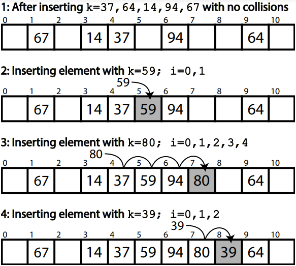

The topics covered here exceed the level of knowledge required to benefit from the course, however provide a more technical explanation of some of the concepts that can help you understand your code's performance.

**Contents**

- [Viewing Python's ByteCode](#viewing-pythons-bytecode): What the Python code you write compiles to and executes as.
- [Hardware Level Memory Accesses](#hardware-level-memory-accesses): A look at how memory accesses pass through a processor's caches.
- [Hashing Data-Structures](#hashing-data-structures): A deeper look at how data structures such as Dictionaries operate.

## Viewing Python's Bytecode

You can use `dis` to view the bytecode generated by Python. The amount of bytecode more strongly correlates with how much code is being executed by the Python interpreter and hence how long it may take to execute. However, this is a crude proxy as it does not account for functions that are called and whether those functions are implemented using Python or C.

The pure Python search compiles to 51 lines of bytecode. (Note that different versions of Python may produce slightly different bytecode than shown here.)

```python
import dis
import random

# Generate sample data
N = 2500
M = 2
ls = [random.randint(0, int(N*M)) for i in range(N)]

def manualSearch():
    ct = 0
    for i in range(0, int(N*M), M):
        for j in range(0, len(ls)):
            if ls[j] == i:
                ct += 1
                break

dis.dis(manualSearch)
```
```output
  9           RESUME                   0

 10           LOAD_CONST               1 (0)
              STORE_FAST               0 (ct)

 11           LOAD_GLOBAL              1 (range + NULL)
              LOAD_CONST               1 (0)
              LOAD_GLOBAL              3 (int + NULL)
              LOAD_GLOBAL              4 (N)
              LOAD_GLOBAL              6 (M)
              BINARY_OP                5 (*)
              CALL                     1
              LOAD_GLOBAL              6 (M)
              CALL                     3
              GET_ITER
      L1:     FOR_ITER                56 (to L5)
              STORE_FAST               1 (i)

 12           LOAD_GLOBAL              1 (range + NULL)
              LOAD_CONST               1 (0)
              LOAD_GLOBAL              9 (len + NULL)
              LOAD_GLOBAL             10 (ls)
              CALL                     1
              CALL                     2
              GET_ITER
      L2:     FOR_ITER                24 (to L4)
              STORE_FAST               2 (j)

 13           LOAD_GLOBAL             10 (ls)
              LOAD_FAST                2 (j)
              BINARY_SUBSCR
              LOAD_FAST                1 (i)
              COMPARE_OP              88 (bool(==))
              POP_JUMP_IF_TRUE         2 (to L3)
              JUMP_BACKWARD           18 (to L2)

 14   L3:     LOAD_FAST                0 (ct)
              LOAD_CONST               2 (1)
              BINARY_OP               13 (+=)
              STORE_FAST               0 (ct)

 15           POP_TOP
              JUMP_BACKWARD           54 (to L1)

 12   L4:     END_FOR
              POP_TOP
              JUMP_BACKWARD           58 (to L1)

 11   L5:     END_FOR
              POP_TOP
              RETURN_CONST             0 (None)
```

Whereas the `in` variant only compiles to 33.

```python
def operatorSearch():
    ct = 0
    for i in range(0, int(N*M), M):
        if i in ls:
            ct += 1

dis.dis(operatorSearch)
```
```output
  1           RESUME                   0

  2           LOAD_CONST               1 (0)
              STORE_FAST               0 (ct)

  3           LOAD_GLOBAL              1 (range + NULL)
              LOAD_CONST               1 (0)
              LOAD_GLOBAL              3 (int + NULL)
              LOAD_GLOBAL              4 (N)
              LOAD_GLOBAL              6 (M)
              BINARY_OP                5 (*)
              CALL                     1
              LOAD_GLOBAL              6 (M)
              CALL                     3
              GET_ITER
      L1:     FOR_ITER                20 (to L3)
              STORE_FAST               1 (i)

  4           LOAD_FAST                1 (i)
              LOAD_GLOBAL              8 (ls)
              CONTAINS_OP              0
              POP_JUMP_IF_TRUE         2 (to L2)
              JUMP_BACKWARD           15 (to L1)

  5   L2:     LOAD_FAST                0 (ct)
              LOAD_CONST               2 (1)
              BINARY_OP               13 (+=)
              STORE_FAST               0 (ct)
              JUMP_BACKWARD           22 (to L1)

  3   L3:     END_FOR
              POP_TOP
              RETURN_CONST             0 (None)
```

A naive assessment of how expensive two functions are can be carried out with this comparison.
However this method of displaying bytecode only shows bytecode for the requested function, so it is not clear how expensive called functions will be or higher level changes to an algorithm which could reduce the number of iterations or similar.

## Hardware Level Memory Accesses

The storage and movement of data plays a large role in the performance of executing software.

<!-- Brief summary of hardware -->
Modern computers typically have a single processor (CPU), within this processor there are multiple processing cores each capable of executing different code in parallel.

Data held in memory by running software exists in RAM, this memory is faster to access than hard drives (and solid-state drives).
But the CPU has much smaller caches on-board, to make accessing the most recent variables even faster.

{alt="An annotated photo of inside a desktop computer's case. The CPU, RAM, power supply, graphics cards (GPUs) and hard-drive are labelled."}

<!-- Read/operate on variable ram->cpu cache->registers->cpu -->
When reading a variable, to perform an operation with it, the CPU will first look in its registers. These exist per core, they are the location that computation is actually performed. Accessing them is incredibly fast, but there only exists enough storage for around 32 variables (typical number, e.g. 4 bytes).
As the register file is so small, most variables won't be found and the CPU's caches will be searched.
It will first check the current processing core's L1 (Level 1) cache, this small cache (typically 64 KB per physical core) is the smallest and fastest to access cache on a CPU.
If the variable is not found in the L1 cache, the L2 cache that is shared between multiple cores will be checked. This shared cache, is slower to access but larger than L1 (typically 1-3MB per core).
This process then repeats for the L3 cache which may be shared among all cores of the CPU. This cache again has higher latency to access, but increased size (typically slightly larger than the total L2 cache size).
If the variable has not been found in any of the CPU's cache, the CPU will look to the computer's RAM. This is an order of magnitude slower to access, with several orders of magnitude greater capacity (tens to hundreds of GB are now standard).

Correspondingly, the earlier the CPU finds the variable the faster it will be to access.
However, to fully understand the caches it's necessary to explain what happens once a variable has been found.

If a variable is not found in the caches, it must be fetched from RAM.
The full 64 byte cache line containing the variable, will be copied first into the CPU's L3, then L2 and then L1.
Most variables are only 4 or 8 bytes, so many neighbouring variables are also pulled into the caches.
Similarly, adding new data to a cache evicts old data.
This means that reading 16 integers contiguously stored in memory should be faster than 16 scattered integers.
Therefore, to **optimally** access variables they should be stored contiguously in memory with related data and worked on whilst they remain in caches.
If you add to a variable, perform large amount of unrelated processing, then add to the variable again it will likely have been evicted from caches and need to be reloaded from slower RAM again.

<!-- Latency/Throughput typically inversely proportional to capacity -->
It's not necessary to remember this full detail of how memory access work within a computer, but the context perhaps helps understand why memory locality is important.

{alt='An abstract representation of a CPU, RAM and Disk, showing their internal caches and the pathways data can pass.'}

::::::::::::::::::::::::::::::::::::: callout

Python as a programming language, does not give you enough control to carefully pack your variables in this manner (every variable is an object, so it's stored as a pointer that redirects to the actual data stored elsewhere).

However all is not lost, packages such as `numpy` and `pandas` implemented in C/C++ enable Python users to take advantage of efficient memory accesses (when they are used correctly).

:::::::::::::::::::::::::::::::::::::::::::::


## Hashing Data-Structures

Within a hashing data structure (such as a dictionary or set) each inserted key is hashed to produce a (preferably unique) integer key, which serves as the basis for indexing. Dictionaries are initialized with a default size, and the initial index of a key is determined by its hash value, modulo the dictionary's length. If this index is available, the key and its associated value are stored there. If the index is already occupied, a collision occurs, and a resolution strategy is applied to find an alternate index.

In CPython's [dictionary](https://github.com/python/cpython/blob/main/Objects/dictobject.c) and [set](https://github.com/python/cpython/blob/main/Objects/setobject.c) implementations, a technique called open addressing is employed. This approach modifies the hash and probes subsequent indices until an empty one is found.

When a dictionary or hash table in Python grows, the underlying storage is resized, which necessitates re-inserting every existing item into the new structure. This process can be computationally expensive but is essential for maintaining efficient average probe times when searching for keys.

{alt="A diagram showing how keys (hashes) 37, 64, 14, 94, 67 are inserted into a hash table with 11 indices. The insertion of 59, 80, and 39 demonstrates linear probing to resolve collisions."}

To look up or verify the existence of a key in a hashing data structure, the key is re-hashed, and the process mirrors that of insertion. The corresponding index is probed to see if it contains the provided key. If the key at the index matches, the operation succeeds. If an empty index is reached before finding the key, it indicates that the key does not exist in the structure.

The above diagrams shows a hash table of 5 elements within a block of 11 slots:

1. We try to add element k=59. Based on its hash, the intended position is p=4. However, slot 4 is already occupied by the element k=37. This results in a collision.
2. To resolve the collision, the linear probing mechanism is employed. The algorithm checks the next available slot, starting from position p=4. The first available slot is found at position 5.
3. The number of jumps (or steps) it took to find the available slot are represented by i=1 (since we moved from position 4 to 5).
In this case, the number of jumps i=1 indicates that the algorithm had to probe one slot to find an empty position at index 5.