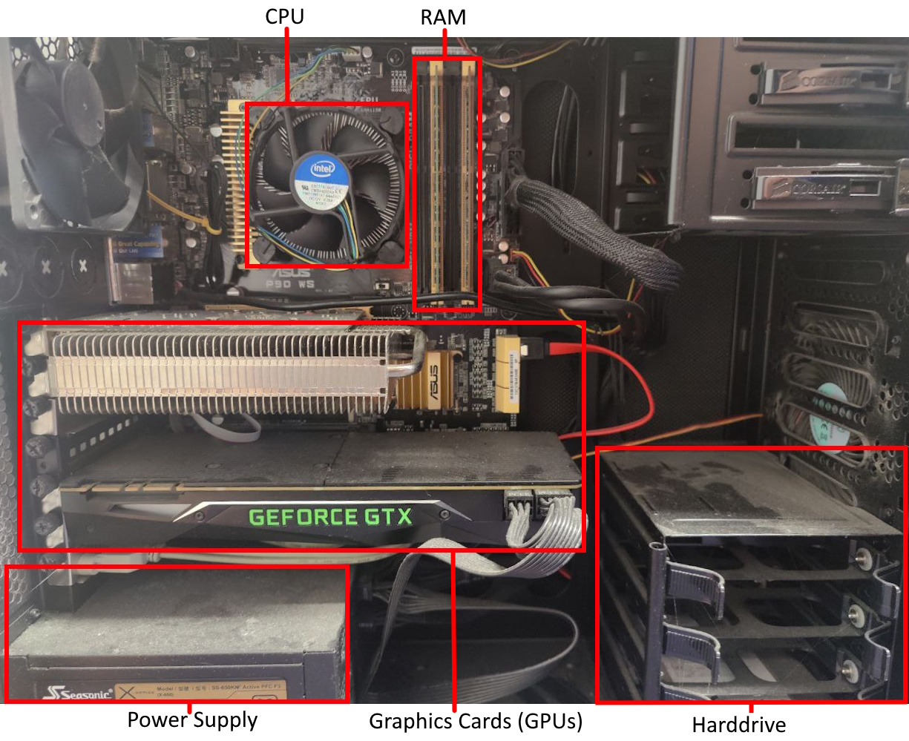
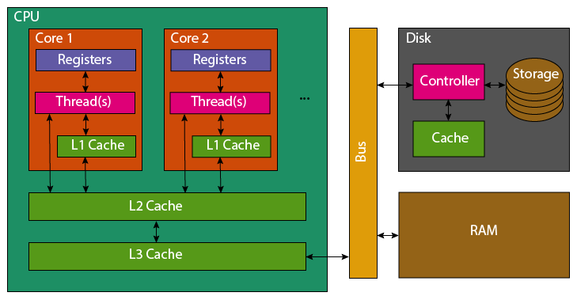

The topics covered here exceed the level of knowledge required to benefit from the course, however provide a more technical explanation of some of the concepts that can help you understand your code's performance.

**Contents**

- [Viewing Python's ByteCode](#viewing-pythons-bytecode): What the Python code you write compiles to and executes as.
- [Hardware Level Memory Accesses](#hardware-level-memory-accesses): A look at how memory accesses pass through a processor's caches.
- []()

## Viewing Python's ByteCode

You can use `dis` to view the bytecode generated by Python, the amount of bytecode more strongly correlates with how much code is being executed by the Python interpreter and hence how long it may take to execute. However, this is a crude proxy as it does not account for whether functions that are called and whether those functions are implemented using Python or C.

The pure Python search compiles to 82 lines of byte-code.

```python
import dis

def manualSearch():
    ls = generateInputs()
    ct = 0
    for i in range(0, int(N*M), M):
        for j in range(0, len(ls)):
            if ls[j] == i:
                ct += 1
                break

dis.dis(manualSearch)
```
```output
 11           0 LOAD_GLOBAL              0 (generateInputs)
              2 CALL_FUNCTION            0
              4 STORE_FAST               0 (ls)

 12           6 LOAD_CONST               1 (0)
              8 STORE_FAST               1 (ct)

 13          10 LOAD_GLOBAL              1 (range)
             12 LOAD_CONST               1 (0)
             14 LOAD_GLOBAL              2 (int)
             16 LOAD_GLOBAL              3 (N)
             18 LOAD_GLOBAL              4 (M)
             20 BINARY_MULTIPLY
             22 CALL_FUNCTION            1
             24 LOAD_GLOBAL              4 (M)
             26 CALL_FUNCTION            3
             28 GET_ITER
        >>   30 FOR_ITER                24 (to 80)
             32 STORE_FAST               2 (i)

 14          34 LOAD_GLOBAL              1 (range)
             36 LOAD_CONST               1 (0)
             38 LOAD_GLOBAL              5 (len)
             40 LOAD_FAST                0 (ls)
             42 CALL_FUNCTION            1
             44 CALL_FUNCTION            2
             46 GET_ITER
        >>   48 FOR_ITER                14 (to 78)
             50 STORE_FAST               3 (j)

 15          52 LOAD_FAST                0 (ls)
             54 LOAD_FAST                3 (j)
             56 BINARY_SUBSCR
             58 LOAD_FAST                2 (i)
             60 COMPARE_OP               2 (==)
             62 POP_JUMP_IF_FALSE       38 (to 76)

 16          64 LOAD_FAST                1 (ct)
             66 LOAD_CONST               2 (1)
             68 INPLACE_ADD
             70 STORE_FAST               1 (ct)

 17          72 POP_TOP
             74 JUMP_FORWARD             1 (to 78)

 15     >>   76 JUMP_ABSOLUTE           24 (to 48)
        >>   78 JUMP_ABSOLUTE           15 (to 30)

 13     >>   80 LOAD_CONST               0 (None)
             82 RETURN_VALUE
```

Whereas the `in` variant only compiles to 54.

```python
import dis

def operatorSearch():
    ls = generateInputs()
    ct = 0
    for i in range(0, int(N*M), M):
        if i in ls:
            ct += 1

dis.dis(operatorSearch)
```
```output
  4           0 LOAD_GLOBAL              0 (generateInputs)
              2 CALL_FUNCTION            0
              4 STORE_FAST               0 (ls)

  5           6 LOAD_CONST               1 (0)
              8 STORE_FAST               1 (ct)

  6          10 LOAD_GLOBAL              1 (range)
             12 LOAD_CONST               1 (0)
             14 LOAD_GLOBAL              2 (int)
             16 LOAD_GLOBAL              3 (N)
             18 LOAD_GLOBAL              4 (M)
             20 BINARY_MULTIPLY
             22 CALL_FUNCTION            1
             24 LOAD_GLOBAL              4 (M)
             26 CALL_FUNCTION            3
             28 GET_ITER
        >>   30 FOR_ITER                10 (to 52)
             32 STORE_FAST               2 (i)

  7          34 LOAD_FAST                2 (i)
             36 LOAD_FAST                0 (ls)
             38 CONTAINS_OP              0
             40 POP_JUMP_IF_FALSE       25 (to 50)

  8          42 LOAD_FAST                1 (ct)
             44 LOAD_CONST               2 (1)
             46 INPLACE_ADD
             48 STORE_FAST               1 (ct)
        >>   50 JUMP_ABSOLUTE           15 (to 30)

  6     >>   52 LOAD_CONST               0 (None)
             54 RETURN_VALUE
```

## Hardware Level Memory Accesses

The storage and movement of data plays a large role in the performance of executing software.

<!-- Brief summary of hardware -->
Modern computers typically have a single processor (CPU), within this processor there are multiple processing cores each capable of executing different code in parallel.

Data held in memory by running software is exists in RAM, this memory is faster to access than hard drives (and solid-state drives).
But the CPU has much smaller caches on-board, to make accessing the most recent variables even faster.

{alt="An annotated photo of inside a desktop computer's case. The CPU, RAM, power supply, graphics cards (GPUs) and harddrive are labelled."}

<!-- Read/operate on variable ram->cpu cache->registers->cpu -->
When reading a variable, to perform an operation with it, the CPU will first look in its registers. These exist per core, they are the location that computation is actually performed. Accessing them is incredibly fast, but there only exists enough storage for around 32 variables (typical number, e.g. 4 bytes).
As the register file is so small, most variables won't be found and the CPU's caches will be searched.
It will first check the current processing core's L1 (Level 1) cache, this small cache (typically 64 KB per physical core) is the smallest and fastest to access cache on a CPU.
If the variable is not found in the L1 cache, the L2 cache that is shared between multiple cores will be checked. This shared cache, is slower to access but larger than L1 (typically 1-3MB per core).
This process then repeats for the L3 cache which may be shared among all cores of the CPU. This cache again has higher latency to access, but increased size (typically slightly larger than the total L2 cache size).
If the variable has not been found in any of the CPU's cache, the CPU will look to the computer's RAM. This is an order of magnitude slower to access, with several orders of magnitude greater capacity (tens to hundreds of GB are now standard).

Correspondingly, the earlier the CPU finds the variable the faster it will be to access.
However, to fully understand the cache's it's necessary to explain what happens once a variable has been found.

If a variable is not found in the caches, it must be fetched from RAM.
The full 64 byte cache line containing the variable, will be copied first into the CPU's L3, then L2 and then L1.
Most variables are only 4 or 8 bytes, so many neighbouring variables are also pulled into the caches.
Similarly, adding new data to a cache evicts old data.
This means that reading 16 integers contiguously stored in memory, should be faster than 16 scattered integers

Therefore, to **optimally** access variables they should be stored contiguously in memory with related data and worked on whilst they remain in caches.
If you add to a variable, perform large amount of unrelated processing, then add to the variable again it will likely have been evicted from caches and need to be reloaded from slower RAM again.

<!-- Latency/Throughput typically inversely proportional to capacity -->
It's not necessary to remember this full detail of how memory access work within a computer, but the context perhaps helps understand why memory locality is important.

{alt='An abstract representation of a CPU, RAM and Disk, showing their internal caches and the pathways data can pass.'}

::::::::::::::::::::::::::::::::::::: callout

Python as a programming language, does not give you enough control to carefully pack your variables in this manner (every variable is an object, so it's stored as a pointer that redirects to the actual data stored elsewhere).

However all is not lost, packages such as `numpy` and `pandas` implemented in C/C++ enable Python users to take advantage of efficient memory accesses (when they are used correctly).

:::::::::::::::::::::::::::::::::::::::::::::


## 